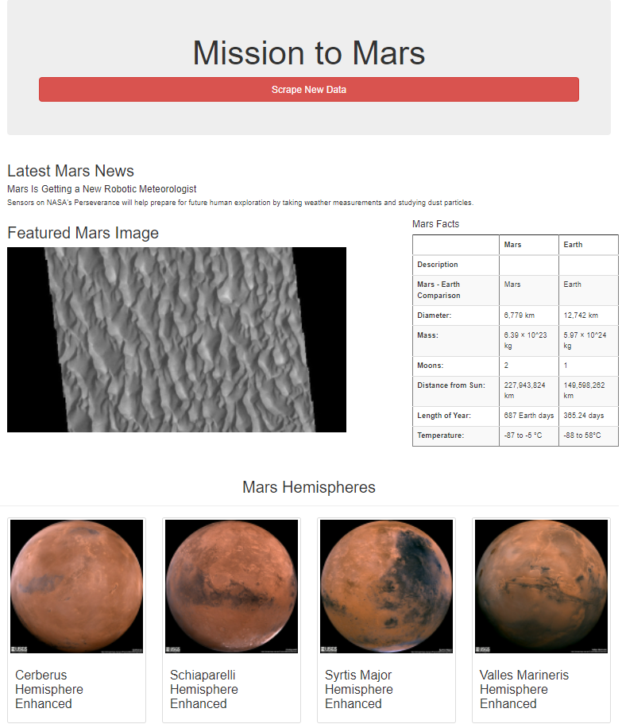

# Mission-to-Mars

## Overview
We executed a web scrapping process to obtain relevant news, facts and images information related to Mars. After obtaining such information, we save it in Mongo and then we load it to an html file via flask. 

Below you will find a summary output of the retrieved information. 

